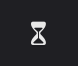
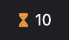
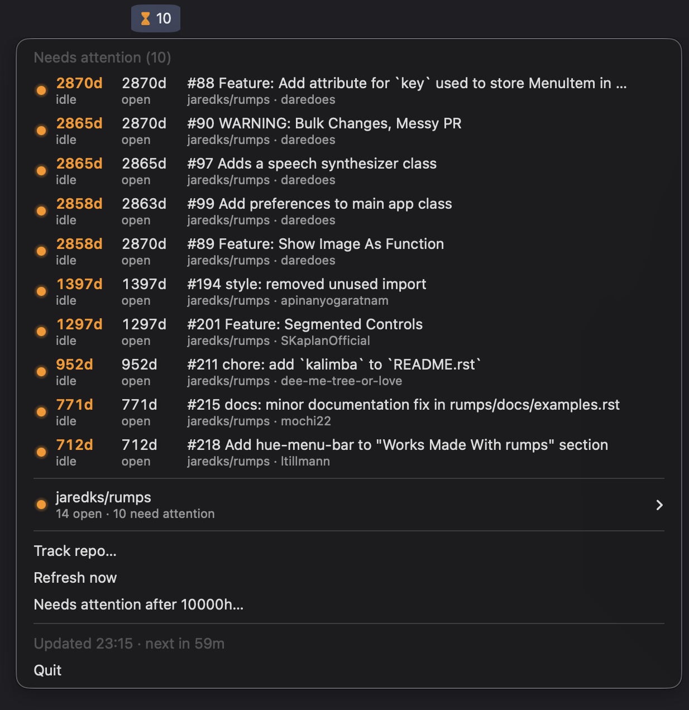

# menubar-pr-lifetime

Tracks the open pull requests of GitHub repos from the macOS menu bar (built with [rumps](https://github.com/jaredks/rumps)) and flags the ones nobody has touched for a while. The menu bar item stays a plain hourglass until a PR needs attention.

| Nothing to do | PRs need attention |
|---|---|
|  |  |



## Needs attention

An open, non-draft PR needs attention when it had no activity for longer than the threshold (24 hours by default). Activity is any of:

- a commit or a force push
- a comment, a review, or a reply in a review thread (comments and reviews by bots don't count)
- the PR being opened, or marked ready for review

The menu shows:

- **Needs attention**: those PRs across all repos, most idle first (up to 15).
- One submenu per repo with all its open PRs, most idle first, with the ones needing attention above a separator. Each PR shows how long it has been idle and open, and its author.

A notification is shown when a PR crosses the threshold, or several at once. PRs that already need attention when a repo is added (or the app starts) only show up in the menu.

## How it works

- Polls every hour (every 5 minutes after an error). Each repo is one GraphQL request per 50 open PRs. The menu shows when the next refresh is due.
- New PRs show up and merged/closed ones drop out on the next refresh; drafts are skipped until they're marked ready.
- The token comes from the GitHub CLI (`gh auth token`), so run `gh auth login` once. The token is never stored.
- The config lives in `~/Library/Application Support/menubar-pr-lifetime/config.json`. The app reloads it within a second when it changes on disk.

## Usage

- **Track repo…** pre-fills a repo URL from the clipboard (any github.com page in the repo works).
- Click a PR to open it in the browser.
- In a repo's submenu: **Open on GitHub**, **Stop tracking**.
- **Refresh now**, **Needs attention after…** (in hours, decimals allowed).

### From the command line

Edits the config, also while the app is running:

```sh
.venv/bin/python pr_lifetime.py add https://github.com/owner/repo  # or owner/repo
.venv/bin/python pr_lifetime.py remove owner/repo other/repo
.venv/bin/python pr_lifetime.py hours 48                           # without a number: show the threshold
.venv/bin/python pr_lifetime.py list
.venv/bin/python pr_lifetime.py help                               # every command and its parameters
```

## Setup

Needs macOS 14 or later (for the second line in menu items).

```sh
python3 -m venv .venv
.venv/bin/pip install -r requirements.txt
```

## Run

```sh
.venv/bin/python pr_lifetime.py
```

To keep it running after the terminal is closed, start it with `nohup` as described in [menubar-pr](../menubar-pr/README.md#run-without-keeping-a-terminal-open):

```sh
nohup .venv/bin/python pr_lifetime.py >/tmp/pr-lifetime.log 2>&1 &
```

Stop it with **Quit** in its menu.
