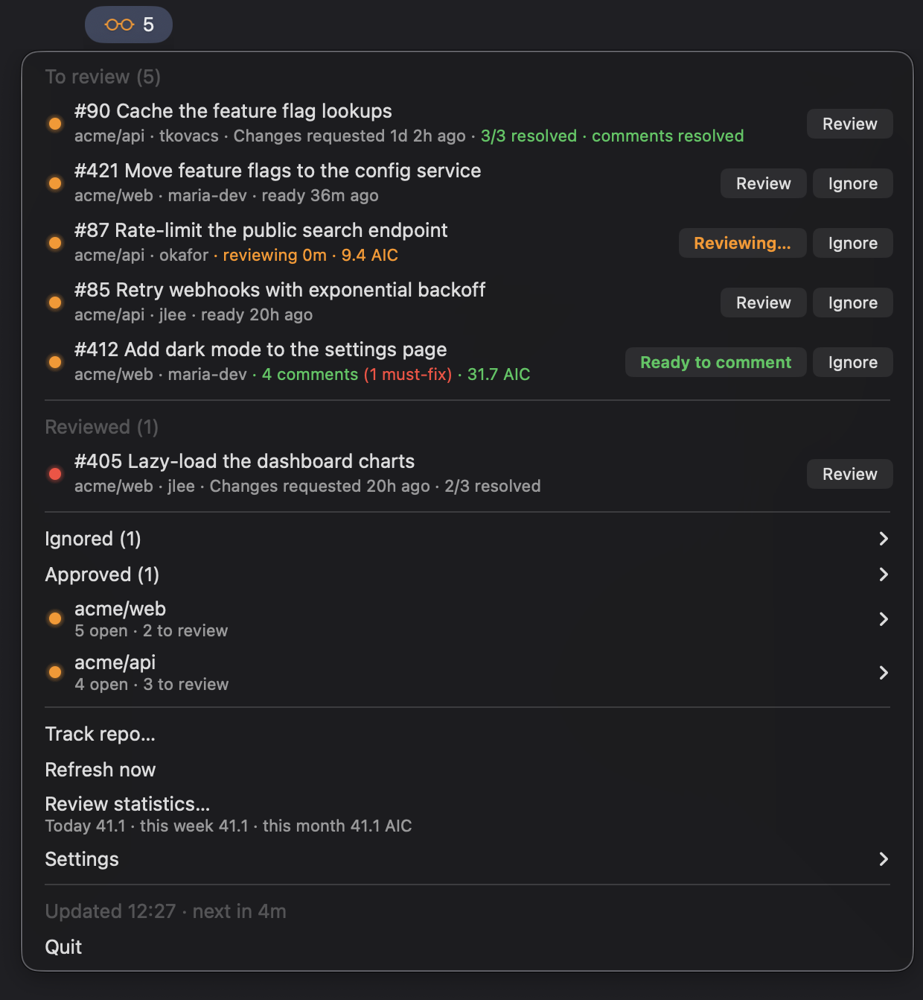
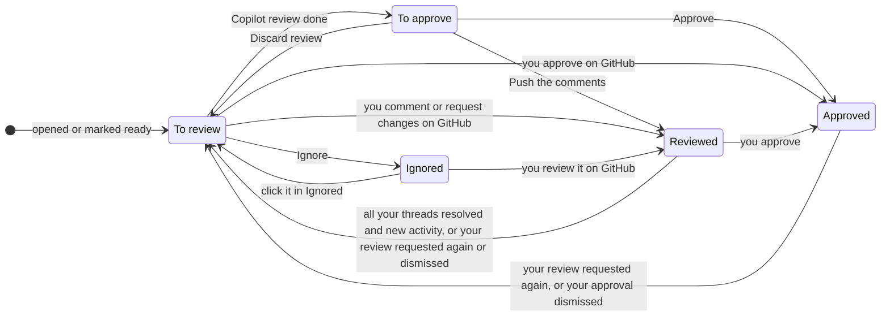
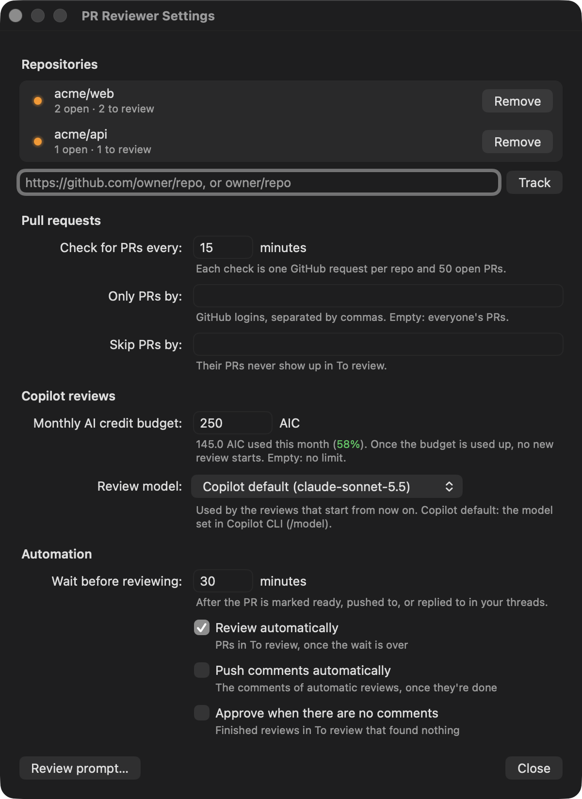
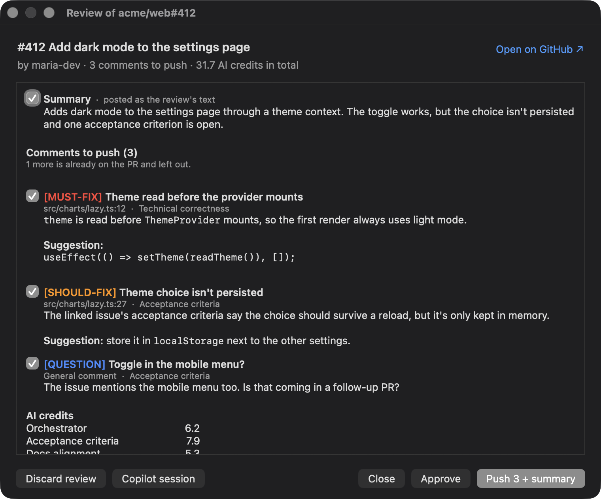
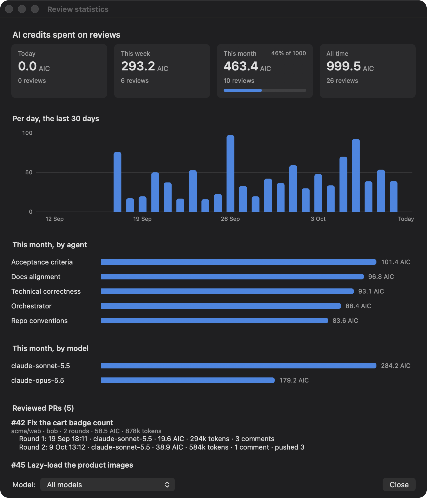

# menubar-pr-reviewer

Watches GitHub repos for pull requests to review, from the macOS menu bar (built with [rumps](https://github.com/jaredks/rumps)). New PRs show up with **Review** and **Ignore** buttons. **Review** has Copilot CLI review the PR in the background, and you see its comments before anything is posted. The PRs you reviewed stay in view until they're merged or closed.

| Nothing to do | PRs to review |
|---|---|
|  |  |



## Features

- **Tracked repos**: add a repo by pasting its URL into **Settings…**, remove it there too. **Settings…** lists each one with its open PRs. A repo that can't be read (e.g. not found, or no access) also shows in the menu, with the error; click it to open it on GitHub.
- **New PR alerts**: a notification when a new PR to review shows up in a tracked repo, once per PR. Checked every 15 minutes by default; change it in **Settings…**.
- **Author filters**: review only certain authors' PRs, or skip some (e.g. bots). In **Settings…**: **Only PRs by** and **Skip PRs by**.
- **Ignore**: hides a PR you won't review. Click **Ignore** on its row; undo it from the **Ignored** submenu.
- **Copilot review**: Copilot checks the PR in the background for acceptance criteria, alignment with the repo's docs, technical correctness, and the conventions the repo already follows in that area. Click **Review** on its row; the button shows how it's going.
- **Comment levels**: each comment is marked `MUST-FIX`, `SHOULD-FIX`, `QUESTION`, `CONSIDER` or `NITPICK`, in the sb-fe-mfe review format. Copilot only suggests fixes it's confident about; when it's unsure, or the acceptance criteria, docs and code disagree, it asks the author a `QUESTION` instead.
- **Readable prompt**: see exactly what Copilot is told. In **Settings…**: **Review prompt…**.
- **Check before posting**: you see every comment, and the AI credits spent, before anything goes to GitHub, and pick which to post: each comment, and the summary, has a checkbox. Click **Ready to comment** to open the review window, then **Push** to post the ticked ones as one review.
- **No duplicate comments**: comments already on the PR, by anyone, are left out, including ones posted while you were reading.
- **Approve**: approves the PR from the review window, with or without comments.
- **Follow-ups**: PRs you reviewed wait in **Reviewed** and come back to **To review** when all your comments are resolved, the author asks for another review, or your review is dismissed (e.g. an approval dismissed by a new push). Approved ones wait in the **Approved** submenu.
- **Automation**: reviews PRs by itself a while after they're ready (30 minutes by default), and can push the comments and approve PRs whose review found nothing. All off by default. In **Settings…** → **Automation**. The row says when, in blue: "auto-review in 12m". Nothing automatic happens in the first 5 minutes after the app starts, so you can see what's due first.
- **Review model**: the Copilot model reviews run on. Pick it in **Settings…** → **Review model**; it applies to reviews started from then on. By default, the model set in Copilot CLI.
- **Monthly budget**: a limit on the AI credits reviews may use per calendar month. Once it's used up, **Review** turns into **Over budget** and no new review starts. Set it in **Settings…**. The share used shows in green, amber from 80% and red once it's used up.
- **AI credit statistics**: a dashboard of the credits spent today, this week and this month (against the budget), per day, per agent, per model, and per PR and review round, with the model each round ran on. Pick a model at the bottom of the window to see only the reviews that used it. Open **Review statistics…** in the menu; its subtitle has the totals. Or run `pr_reviewer.py stats` (`--model` for one model).
- **Safe reviews**: Copilot only reads; it runs sandboxed, with no network or GitHub access. Only the app posts, and only when you click.
- **Command line**: add and remove repos, edit the author lists and set the budget from the terminal, also while the app runs.

## Groups



With automation on, the moves out of To review and To approve can happen by themselves: a review starts once the wait is over, and its comments are pushed or the PR approved. A PR leaves every group when it's merged, closed or turned back into a draft. Your own PRs are in none.

- **To review**: open, non-draft PRs that you haven't reviewed or ignored, the newest first (by when they were opened or marked ready for review). A notification is shown when a new one appears, once per PR. PRs that were already open when a repo is added only show up in the menu.
  A PR you reviewed comes back here, at the top and with a notification, when the author requests your review again, when your review is dismissed (some repos dismiss approvals on a new push), or when all the review threads you started are resolved and something happened since your last review (new commits, or replies in them). It then has no Ignore button. Reviewing it again (e.g. pushing a new round of comments) sends it back to Reviewed.
- **To approve**: PRs in To review whose Copilot review is done, waiting for you: **No comments** (approve it) or **Ready to comment** (push the comments, approve, or both). Running and failed reviews stay in To review. The menu bar number counts both groups.
- **Reviewed**: PRs you submitted a review for on GitHub (an approval, a change request or a comment review), waiting on the author. Clicking **Review** alone doesn't move a PR here. Their dot shows your review state as GitHub does (a comment review doesn't undo an approval or a change request): red for changes requested, gray otherwise. The second line counts how many of the review threads you started are resolved, in green once all are. New commits alone don't move a PR or notify you: it comes back to To review once your threads are resolved.
- **Approved**: PRs you approved, in a submenu; click one to open it. One moves to To review when the author requests your review again, or when your approval is dismissed.
- **Ignored**: PRs you ignored. They don't come back unless you review them. Click one in the submenu to put it back in To review.

Your own PRs are left out. Merged and closed PRs drop out on the next refresh, and so do PRs turned back into drafts. When a draft is marked ready, it counts as new. Each group lists 10 PRs; the rest are in a submenu below them.

The menu bar count is the number of PRs in To review and To approve.

## Settings



**Settings…** opens a window. A text field is saved when you press Return or leave it, a checkbox when you click it. When a value isn't valid, the field goes back to the saved one and the line under it says why.

- **Repositories**: the tracked repos, with their open PRs, or the error when one can't be read. Paste a repo URL (any github.com page in the repo works) or `owner/repo` and press **Track**; when the clipboard holds a repo you don't track yet, the window opens with it filled in. **Remove** stops tracking a repo (it asks first: its Copilot reviews are deleted).
- **Check for PRs every**: how often the tracked repos are checked, in minutes; 15 by default.
- **Only PRs by**: when the list isn't empty, only PRs by these authors show up in To review.
- **Skip PRs by**: PRs by these authors never show up in To review.
- **Monthly AI credit budget**: AI credits Copilot reviews may use per calendar month; empty for no limit. The line under it shows how much this month used: finished reviews, plus what running ones have spent so far. Once the budget is used up, the **Review** button reads **Over budget** (click it to see why, or to change the budget), and **Retry** on a failed review is blocked too. Reviews that already ran can still be pushed and approved. Each review is capped at what's left of the budget (`--max-ai-credits`); Copilot's smallest cap is 30, so the budget can be overshot by up to that.
- **Review model**: the model new reviews run on: **Copilot default** (the model set in Copilot CLI, shown in brackets), **Auto** (Copilot picks), or one of the models Copilot CLI offers. Running reviews keep theirs.
- **Review prompt…**: shows the prompt Copilot gets and the subagents' instructions, read-only, from the files in [`copilot/`](copilot/).

**Automation** (all off by default):

- **Wait before reviewing**: minutes after a PR's last activity (marked ready for review, a push, or a reply in your threads) before it's reviewed automatically; 30 by default. So the author can finish, and other automatic reviews can run first. A push restarts the wait.
- **Review automatically**: reviews the PRs in To review that would show a **Review** button, once the wait is over. The row says when, in blue: "auto-review in 12m". Only PRs whose wait wasn't over yet when you switched it on, or that are active after that, so it doesn't review your backlog; and only PRs with new activity since their last review, so a review you pushed, approved or discarded isn't redone until the author does something. One automatic review runs at a time, within the monthly budget.
- **Push comments automatically**: posts the comments of automatic reviews as soon as they're done. Reviews you start yourself still wait for you.
- **Approve when there are no comments**: approves PRs in To review whose review (yours or automatic) found nothing. It asks before turning on.

Nothing is pushed or approved automatically when the PR got new commits after its review started, or when an automatic attempt failed; those stay for you. And nothing automatic happens in the first 5 minutes after the app starts: reviews that came due while it was off start after that, and the rows count down to it.

The author lists take GitHub logins (case doesn't matter, `@` and `[bot]` are optional). They don't apply to Reviewed: a PR you reviewed stays there whoever wrote it.

## Buttons

- **Review**: starts a Copilot review (see below). The button follows it:
  - **Reviewing…** (orange): Copilot is at work. The row shows for how long and the AI credits (AIC) used so far. Click to stop it.
  - **Ready to comment** (green): click to see the comments, then push them.
  - The row says **new commits** (amber) when the PR got commits after the review started: pushing puts the comments on the reviewed commit, where GitHub marks the ones on changed lines as outdated, and approving asks about the latest commit. Discard the review and review again to cover them.
  - **No comments** (blue): Copilot found nothing worth a comment. Click to see its summary and the AI credits used, and to approve.
  - **Review failed** (red): click to see why, and retry.
- **Ignore**: moves the PR to Ignored.
- Click anywhere else on a PR row to open it in the browser.

Starting a review and **Ignore** keep the menu open, so you can work through the list. Buttons that show a dialog or a window close it.

A PR moves to Reviewed once a review of yours is on GitHub, e.g. after pushing the comments.

## Copilot reviews



**Review** gathers the PR's description, linked issues, diff and existing comments into a review folder, checks out the PR's head commit there, and runs [Copilot CLI](https://docs.github.com/copilot/how-tos/copilot-cli) headless (`copilot -p`) in that folder. The prompt is in [`copilot/review-prompt.md`](copilot/review-prompt.md). It has four subagents, in [`copilot/.github/agents/`](copilot/.github/agents/), check the PR in parallel:

- `prr-acceptance`: are the acceptance criteria (in the description or a linked issue) met?
- `prr-docs`: does the change follow the repo's markdown docs (READMEs, `AGENTS.md`, `docs/`, Copilot instructions…), and update them where it should?
- `prr-code`: is it technically correct?
- `prr-conventions`: does it follow the conventions the repo already uses in that area (how other analytics events are named and sent, how similar components or services are built, naming, patterns, tests)? These are inferred from examples, so its findings are always `QUESTION`s that name the examples and ask whether the difference is intended.

Copilot merges their findings and drops the ones an existing comment already makes, whoever wrote it.

Each comment has a level, and they're listed in this order: `MUST-FIX` (blocks the merge), `SHOULD-FIX` (breaks the repo's guidelines), `QUESTION` (needs the author's answer), `CONSIDER` (an improvement), `NITPICK` (style, only when a repo doc backs it). Comments are posted in the format of the sb-fe-mfe review guidelines:

```markdown
**[SHOULD-FIX]** Brief description

Details and reasoning.

**Suggestion:** …

**Reference:** …
```

Copilot only states a problem or suggests a fix when it's confident: it checked it in the code or the docs. When it's unsure, and always when the acceptance criteria, the repo's markdown docs and the code don't agree, it asks a `QUESTION` so the author investigates; a possible fix goes in the question, not in a **Suggestion:**.

A row with a finished review says how many comments are must-fix.

The **Ready to comment** window lists the comments to push, the summary, and the AI credits used by each agent and in total. Its numbers come from the Copilot session's log, `~/.copilot/session-state/<session>/events.jsonl`. Each comment, and the summary, has a checkbox, all ticked to start with; **Push** posts the ticked ones as one review, and its title says what that is ("Push 3 + summary"). The summary becomes the review's text; comments on lines outside the diff go there too, and the rest sit on their lines. Right before posting, the app checks the PR again and leaves out comments that someone has meanwhile posted. When there's nothing to push, there's no Push button. **Approve** approves the PR at the commit Copilot reviewed, with or without comments to push: when there are some, it asks first, and they stay in the window to push or discard. If the PR got new commits since the review (the window and the row say so), GitHub won't take an approval of the reviewed commit; **Approve** then asks whether to approve the latest commit anyway, or you can discard the review and review it again. **Discard review** deletes the comments, and **Copilot session** opens the transcript. **Open on GitHub ↗**, next to the PR's title, opens the PR in the browser.

Copilot only reads and reports; the app posts the comments, after you've seen them. Because the PR's description and comments are written by others, Copilot runs with an allowlist instead of `--allow-all-tools`:

- shell commands: `git diff`, `git log`, `git show`, `git blame`, `git grep`, `git status`, `cd`, `pwd`, `ls`, `cat`, `head`, `tail`, `wc`, `grep`, `rg`, `sort`, `uniq`, `diff`
- writing only its result file
- `--sandbox` (shell commands run in macOS's `sandbox-exec`, and can only read the review folder), no network (`--deny-tool=url`), no GitHub MCP server, and `gh`, `curl`, `wget`, `git push` and `git fetch` denied
- the working directory is the review folder, not the PR's checkout, so Copilot doesn't load instructions, agents or hooks that the PR adds

Setup: install Copilot CLI (`brew install copilot-cli`) and sign in once with `copilot login`. Optional key in `config.json`:

- `"copilot_max_ai_credits"`: a cap per review (at least 30), passed as `--max-ai-credits`. With a monthly budget, the lower of the two applies.

Reviews keep running when the app quits, and the app picks them up when it starts again.

## Statistics



**Review statistics…** opens a dashboard: the AI credits spent today, this week (from Monday), this month and in all, with a bar that shows how much of the monthly budget is used (amber from 80%, red when it's used up); the credits per day for the last 30 days (hover a day for its numbers); this month's credits per agent, to see which check costs most, and per model; and every reviewed PR with its review rounds: when, the model, the AI credits and tokens, the comments, and whether they were pushed, the PR approved, or the review discarded or stopped. Running reviews count with what they've spent so far.

**Model** at the bottom shows only the reviews that used one model, whole (a review on Auto can use several), with the pushes and approvals that followed them. The budget bar and running reviews show only with **All models**. Reviews stopped before they finished are listed under the model they were started with.

The menu item's subtitle sums it up, e.g. "Today 47.0 · this week 92.1 · this month 144.9 of 250 AIC (58%)". The percentage is green, amber from 80% of the budget (with a ⚠︎ in front), and the line says "Over budget" in red once it's used up.

Every review is logged to `history.jsonl` next to the config when it ends, and so is what you do with it. A stopped review counts with the AI credits it had used by then.

## How it works

- Polls every 15 minutes by default (**Check for PRs every** in **Settings…**), every 2 minutes after an error. Each repo is one GraphQL request per 50 open PRs.
- The token comes from the GitHub CLI (`gh auth token`), so run `gh auth login` once. The token is never stored.
- `~/Library/Application Support/menubar-pr-reviewer/` holds `config.json` (repos, check interval, author lists, budget, automation, Copilot options), `state.json` (the PRs already seen or ignored, and the Copilot reviews) and `history.jsonl` (the reviews' log). The app reloads the config within a second when it changes on disk.
- Reviews work in `reviews/` next to them. Each repo is cloned once into `clones/` (the first review of a repo takes longer), and each review gets a quick, hardlinked clone of it in its folder. A review's checkout is removed when Copilot is done, and the rest when it's pushed or discarded, or the PR is closed.

## Usage

- **Settings…**: tracked repos and everything else above.
- Click a repo that can't be read to open it on GitHub.
- **Refresh now**.

### From the command line

Edits the config, also while the app is running:

```sh
.venv/bin/python pr_reviewer.py add https://github.com/owner/repo  # or owner/repo
.venv/bin/python pr_reviewer.py remove owner/repo other/repo
.venv/bin/python pr_reviewer.py allow alice bob                    # without logins: show the list
.venv/bin/python pr_reviewer.py block --remove renovate
.venv/bin/python pr_reviewer.py budget 500                         # without a number: show it; --off: no limit
.venv/bin/python pr_reviewer.py list
.venv/bin/python pr_reviewer.py stats                              # AI credits spent, and the reviewed PRs
.venv/bin/python pr_reviewer.py stats --model claude-opus-5.5      # only the reviews that used this model
.venv/bin/python pr_reviewer.py help                               # every command and its parameters
```

## Setup

Needs macOS 14 or later (for the second line in menu items).

```sh
python3 -m venv .venv
.venv/bin/pip install -r requirements.txt
```

## Tests

The logic is covered by tests: which group a PR is in and when it moves, automation, reading Copilot's results and credits, what gets posted, the history and statistics, the settings, the config and the command line. They run on scratch folders, with GitHub and Copilot stubbed, in under a second. The menus and windows aren't; check those by hand.

```sh
.venv/bin/pip install -r requirements-dev.txt
.venv/bin/python -m pytest tests
```

## Run

```sh
.venv/bin/python pr_reviewer.py
```

To keep it running after the terminal is closed, start it with `nohup` as described in [menubar-pr](../menubar-pr/README.md#run-without-keeping-a-terminal-open):

```sh
nohup .venv/bin/python pr_reviewer.py >/tmp/pr-reviewer.log 2>&1 &
```

Stop it with **Quit** in its menu.
