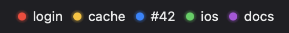
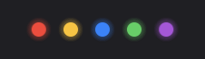
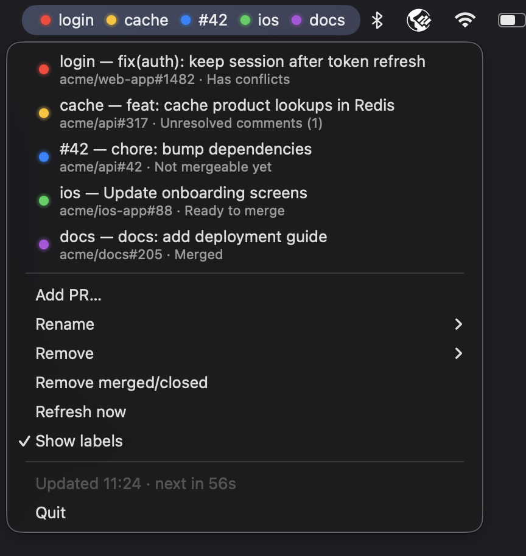

# menubar-pr

Watches GitHub pull requests from the macOS menu bar (built with [rumps](https://github.com/jaredks/rumps)). A single menu bar item shows one LED per PR.

| With labels | Dots only |
|---|---|
|  |  |



## States

Checked in this order; the first match wins.

| LED | Meaning |
|---|---|
| red | merge conflicts, or failing CI checks |
| yellow | unresolved review threads, or changes requested |
| blue | not mergeable yet (waiting for review, pending checks, draft, behind base) |
| green | ready to merge |
| purple | merged |
| gray | closed, not found / no access, or not checked yet |

When GitHub is still computing mergeability (right after a push), the previous state is kept.
A notification is shown whenever a PR changes state, and when a PR gets a new unresolved thread.

## How it works

- Polls every 60 s. All watched PRs are fetched in one GraphQL request. The menu shows when the next refresh is due.
- The token comes from the GitHub CLI (`gh auth token`), so run `gh auth login` once. The token is never stored.
- The watchlist lives in `~/Library/Application Support/menubar-pr/config.json`. The app reloads it within a second when it changes on disk.

## Usage

- **Add PR…** pre-fills a PR URL from the clipboard. You can append a short label, e.g. `https://github.com/owner/repo/pull/123 auth`. Without a label, `#123` is used.
- Click a PR in the menu to open it in the browser.
- **Rename**, **Remove**, **Remove merged/closed**, **Refresh now**, **Show labels**.

### From the command line

Edits the watchlist, also while the app is running (so Claude or a script can add PRs):

```sh
.venv/bin/python pr_watch.py add https://github.com/owner/repo/pull/123 auth   # label is optional
.venv/bin/python pr_watch.py remove owner/repo#123 "other label"               # by URL, owner/repo#123 or label
.venv/bin/python pr_watch.py list
.venv/bin/python pr_watch.py help                                              # every command and its parameters
```

## Setup

Needs macOS 14 or later (for the second line in menu items).

```sh
python3 -m venv .venv
.venv/bin/pip install -r requirements.txt
```

## Run

```sh
.venv/bin/python pr_watch.py
```

### Run without keeping a terminal open

Start it detached from the terminal (it keeps running after the terminal is closed, but not after a restart):

```sh
# log output to /tmp/pr-watch.log
nohup .venv/bin/python pr_watch.py >/tmp/pr-watch.log 2>&1 &

# or discard output, and also drop it from the shell's job list
nohup .venv/bin/python pr_watch.py >/dev/null 2>&1 &
disown
```

- `nohup` makes the app ignore the hang-up signal the terminal sends when it closes.
- `>file 2>&1` sends normal output and error output to the file (`/dev/null` discards it).
- `&` runs it in the background, and `disown` removes it from the shell's job list.

Stop it with **Quit** in its menu.
