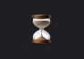
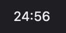
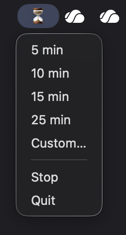

# menubar-timer

Countdown timer in the macOS menu bar (built with [rumps](https://github.com/jaredks/rumps)).

| Idle | Counting down | Menu |
|---|---|---|
|  |  |  |

When time is up, it plays a sound and shows a notification.

## Setup

```sh
python3 -m venv .venv
.venv/bin/pip install -r requirements.txt
```

## Run

```sh
.venv/bin/python timer.py
```
